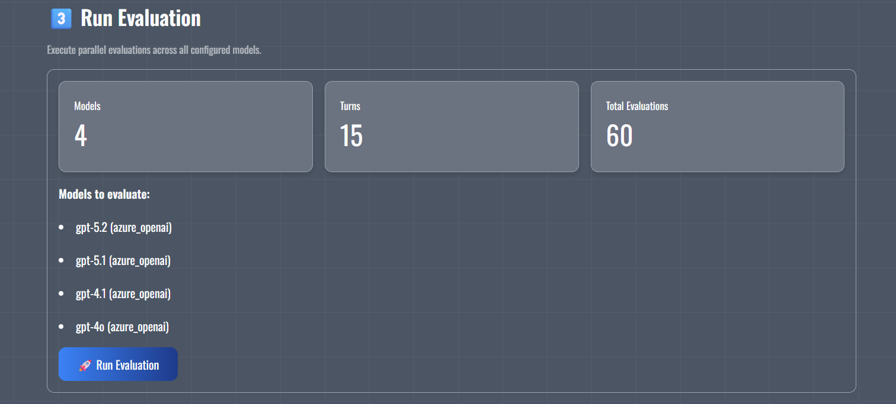
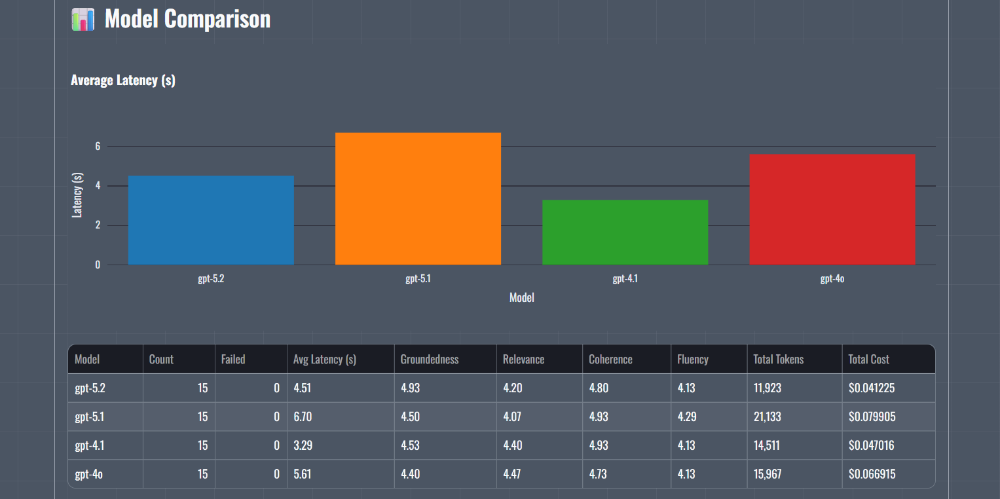
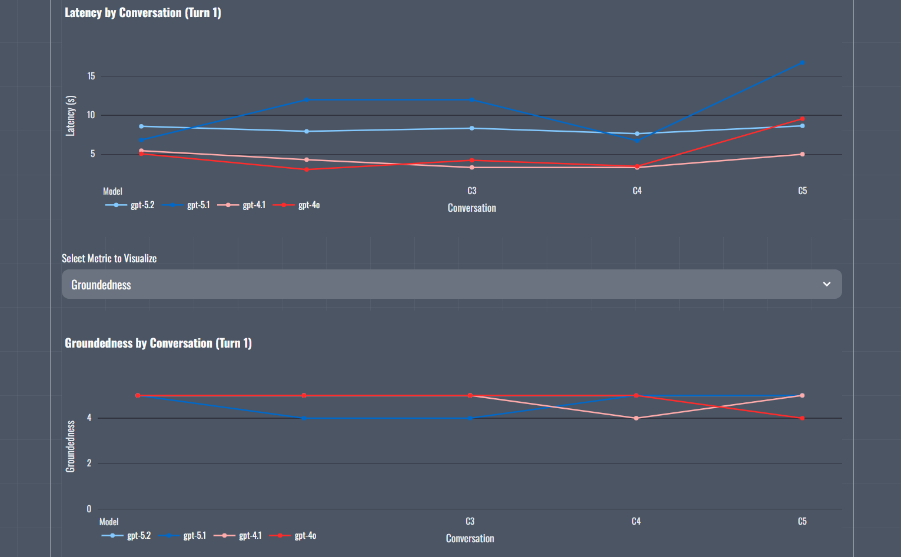
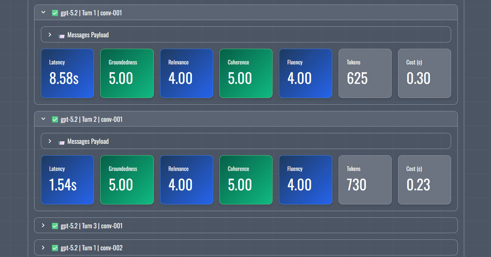

# 🧪 LLM Evaluation Tool

Compare multiple LLM models in parallel with standard RAG evaluation metrics. Configure up to 5 models, upload grounding documents, generate question datasets, and view comprehensive performance comparisons.


## Configure System Prompt, concurrency, retries, and more


## Upload multiple documents and generate a dataset



## Run evaluation across multiple models simultaneously



## View average latency, RAG Metrics, and even the total cost



## View RAG Metrics for each conversation turn



## Dive deep into each conversation turn

## 📋 Prerequisites

- **Python 3.11+** (required for modern type hints and async features)
- **Azure OpenAI** subscription or OpenAI API access
- **uv** (recommended) or pip for package management
- **Make** (optional, for convenient task commands)
  - Windows: `choco install make` or use WSL
  - Linux/macOS: pre-installed

## 🔧 Installation

1. **Clone the repository:**
```bash
git clone https://github.com/robrita/llm-evaluation-tool.git
cd llm-evaluation-tool
```

2. **Install dependencies:**
```bash
uv sync
```

3. **Activate the virtual environment:**

**On Windows:**
```bash
.venv\Scripts\activate
```

**On Linux/macOS:**
```bash
source .venv/bin/activate
```

4. **Configure Azure OpenAI credentials:**

LLM models are configured through the application UI. The configuration is stored locally in `.conf/llm_eval_config.json` (gitignored).

For Azure Identity authentication, ensure you're logged in:
```bash
az login
```

## 🚀 Usage

### Quick Start (Recommended)
```bash
# Install dependencies
make install

# Run app
make run
```

### Common Commands

| Command | Purpose |
|---------|---------|
| `make run` | Start the Streamlit app |
| `make format` | Auto-fix lint issues and format code |
| `make lint` | Check code style (no changes) |
| `make test-unit` | Run fast unit tests |
| `make test-cov` | Generate coverage report |
| `make check-and-run` | Validate code style and launch the app |

### Direct Commands (without Make)
```bash
# Run application
uv run streamlit run app.py

# Code quality
uv run ruff check --fix .
uv run ruff format .

# Testing
uv run pytest -m unit -v
uv run pytest --cov --cov-report=html
```

The application opens at `http://localhost:8501`

## ✨ Features

### 0️⃣ Model Configuration
- Configure generator model for question generation
- Configure up to 5 evaluation models for comparison
- Support for Azure OpenAI and OpenAI APIs
- Connection validation with latency testing
- Persistent configuration across sessions

### 1️⃣ Document Upload
- Upload PDF grounding documents (up to 50MB)
- Automatic text extraction using PyMuPDF
- Multi-document support with merged content
- Preview extracted content

### 2️⃣ Question Dataset
- Generate multi-turn Q&A conversations
- Configurable number of conversations and turns
- Automatic dataset persistence
- Load and reuse previous datasets

### 3️⃣ Run Evaluation
- Parallel evaluation across all configured models
- Progress tracking with real-time updates
- Automatic retry for transient errors (429, 503)
- Configurable timeout and concurrency settings

### 4️⃣ Results Dashboard
- **Latency Comparison:** Bar charts showing average response time per model
- **RAG Metrics:** Groundedness, relevance, coherence, and fluency scores
- **Model Comparison Table:** Side-by-side metrics for all models
- **Detailed Results:** Drill-down into individual question responses
- **Run History:** Load and review previous evaluation runs
- **Filtering:** Filter results by model, conversation, and turn

### 💰 Pricing (Optional Page)
- View Azure OpenAI pricing information
- Compare model pricing across tiers

## 🛠️ Technology Stack

- **Framework:** Streamlit 1.50.0 (Python web app framework)
- **LLM Integration:** OpenAI SDK 2.3.0 (Azure OpenAI compatible)
- **Authentication:** Azure Identity (DefaultAzureCredential) or API key
- **PDF Processing:** PyMuPDF for text extraction
- **Configuration:** Pydantic 2.10.6+ for data validation
- **Package Manager:** uv + pyproject.toml (10-100x faster than pip)
- **Code Quality:** Ruff (fast Python linter & formatter)
- **Testing:** pytest with unit/integration tests
- **Visualization:** Plotly for interactive charts

## 📊 RAG Metrics

The tool evaluates LLM responses using standard RAG metrics (scored 1-5):

| Metric | Description |
|--------|-------------|
| **Groundedness** | How well the response is supported by the grounding context |
| **Relevance** | How relevant the response is to the question asked |
| **Coherence** | How logically structured and coherent the response is |
| **Fluency** | How grammatically correct and naturally written the response is |

Metrics are calculated using the configured generator model as a judge.

## 🔒 Security

- **Local Configuration:** Model credentials saved locally in `.conf/llm_eval_config.json` (gitignored)
- **No Hardcoded Secrets:** API keys and endpoints loaded at runtime
- **Input Validation:** Pydantic schemas enforce strict data validation
- **Azure Identity Support:** Use managed identity instead of API keys

## 🤝 Contributing

Contributions are welcome! Please follow these guidelines:

1. **Fork** the repository and create a feature branch
2. **Format** your code: `make format`
3. **Test** your changes: `make test-unit`
4. **Follow** code quality standards (see [AGENTS.md](AGENTS.md))
5. **Submit** a Pull Request with a clear description

See `.github/instructions/` for detailed development guidelines.

## 📝 License

This project is open source and available under the **MIT License**.

## 📧 Support

For support, please [open an issue](https://github.com/robrita/llm-evaluation-tool/issues) in the GitHub repository.

## 🔗 Useful Links

- [Azure OpenAI Documentation](https://learn.microsoft.com/azure/ai-services/openai/)
- [OpenAI API Documentation](https://platform.openai.com/docs/)
- [RAG Evaluation Best Practices](https://learn.microsoft.com/azure/ai-studio/concepts/evaluation-metrics-built-in)

## 🙏 Acknowledgments

Built with modern Python tools and Azure AI services:
- [Streamlit](https://streamlit.io/) - Web application framework
- [Azure OpenAI Service](https://azure.microsoft.com/en-us/products/ai-services/openai-service/) - LLM inference
- [uv](https://github.com/astral-sh/uv) - Fast Python package manager
- [Ruff](https://github.com/astral-sh/ruff) - Lightning-fast Python linter
